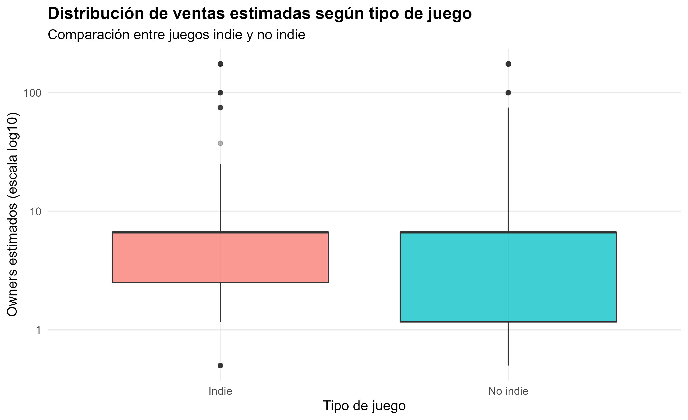
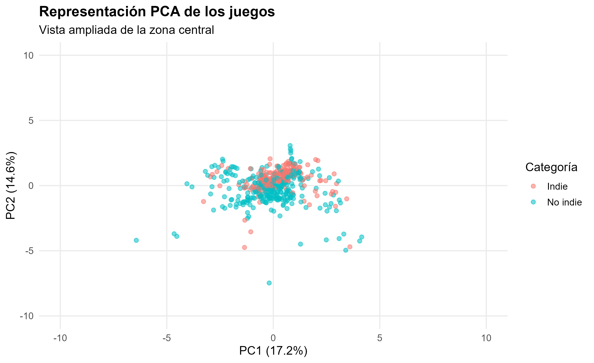
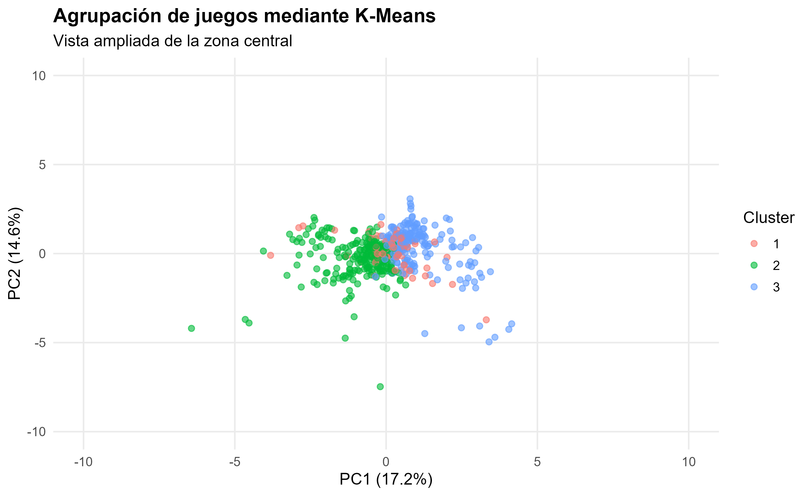

```{=latex}
\sinportada

\criterios{Metadatos}{
  \item \textbf{Integrantes del grupo:}
    \begin{itemize}
      \item Agustín Barbatelli Balboa
      \item Adrián Cordones Martínez
    \end{itemize}
    
  \item \textbf{Enlace al repositorio con el código:}\\
    \url{https://github.com/adriancordones/steam-apps-analysis}
    
  \item \textbf{Enlace al vídeo de explicación:}\\
    \url{https://...}
}
```

Las librerías necesarias ...

```{r setup, message = FALSE, warning = FALSE}
library(dplyr)
library(stringr)
library(knitr)
library(httr)

knitr::opts_chunk$set(echo = FALSE)
readRenviron(".Renviron")
```

# Descripción

<!-- TODO: Esta es la descripción de la Práctica 1, habrá que reajustarla al contexto de esta práctica. -->

```{=latex}
Este dataset recoge metadatos de aplicaciones publicadas en la \textit{Steam Store}, extraídos mediante web scraping de las páginas individuales de producto. Cada registro corresponde a un juego o aplicación e incluye información identificativa (título, desarrollador, editor), condiciones comerciales (precio, descuento), recepción por parte de los usuarios (número y resumen general de reseñas), características de contenido (DLCs, logros, idiomas, banda sonora) y clasificación temática (géneros y etiquetas de la comunidad). Los datos reflejan el estado de la tienda en el momento de la extracción (abril de 2026) y cubren los títulos más populares y recientes según los resultados de búsqueda de Steam para España y con la página en español.
```

# Integración y selección

<!-- TODO: a) Integración: nuevas variables útiles, etc 
           b) Selección: descartar variables no relevantes y quedarnos con las útiles
-->

```{=latex}
...
```

```{r integración_1}
# Carga del dataset
df <- read.csv("../datasets/steam_apps.csv", sep = ",", dec = ".")
# TODO: Arreglar para que no se rompan los caracteres de TM, (R), etc.

# Función de ayuda
get_var <- function(data, path) {
  if (is.null(data)) return(NA)
  result <- data
  for (key in path) {
    result <- result[[key]]
    if (is.null(result)) return(NA)
  }
  return(result)
}

# Función genérica para requests
get_response <- function(url, cooldown = 10) {
  response <- tryCatch(GET(url, timeout(cooldown)), error = function(e) NULL)
  if (is.null(response) || status_code(response) != 200) return(NULL)
  data <- content(response, as = "parsed", type = "application/json")
  
  return(data)
}

# Función para consultas a API de Steam: restricciones de edad y reviews
get_steam <- function(app_id) {
  url <- paste0("https://store.steampowered.com/appreviews/", app_id, "?json=1&purchase_type=all&num_per_page=0")
  data <- get_response(url)
  total_positive <- get_var(data, c("query_summary", "total_positive"))
  total_reviews <- get_var(data, c("query_summary", "total_reviews"))
  
  url <- paste0("https://store.steampowered.com/api/appdetails?appids=", app_id)
  data <- get_response(url)
  app_id <- as.character(app_id)
  required_age <- get_var(data, c(app_id, "data", "required_age"))
  pegi <- get_var(data, c(app_id, "data", "ratings", "pegi", "rating"))
  
  result <- list(total_positive = total_positive, total_reviews = total_reviews,
                required_age = required_age, pegi = pegi)
  
  return(result)
}

# Función para consultas a API de SteamSpy: ventas estimadas
get_steamspy <- function(app_id, cooldown = 1) {
  url <- paste0("https://steamspy.com/api.php?request=appdetails&appid=", app_id)
  data <- get_response(url)
  owners <- get_var(data, c("owners"))
  
  return(owners)
}

api_key <- Sys.getenv("ITAD_KEY")
# Función para consultas a API de ITAD: pico máximo de jugadores
get_itad <- function(app_id) {
  url <- paste0("https://api.isthereanydeal.com/games/lookup/v1?key=", api_key, "&appid=", app_id)
  data <- get_response(url)
  itad_id <- get_var(data, c("game", "id"))
  
  url <- paste0("https://api.isthereanydeal.com/games/info/v2?key=", api_key, "&id=", itad_id)
  data <- get_response(url)
  players_peak <- get_var(data, c("players", "peak"))
  
  return(players_peak)
}

# TODO: Pruebas para 500 primeros, esto debe generalizarse (e incorporar tiempos de espera)
# Steam
steam_results <- lapply(df$id[1:5], function(id) get_steam(id))
df[1:5, "total_positive"] <- sapply(steam_results, function(x) x$total_positive)
df[1:5, "total_reviews"] <- sapply(steam_results, function(x) x$total_reviews)
df[1:5, "required_age"] <- sapply(steam_results, function(x) x$required_age)
df[1:5, "pegi"] <- sapply(steam_results, function(x) x$pegi)
# SteamSpy
steamspy_results <- lapply(df$id[1:5], get_steamspy)
df[1:5, "owners"] <- sapply(steamspy_results, function(x) x)
# ITAD
itad_results <- lapply(df$id[1:5], function(id) get_itad(id))
df[1:5, "players_peak"] <- sapply(itad_results, function(x) x)
```

# Limpieza de los datos

<!-- TODO:
- Realmente la parte de rehacer la/s columna/s con datos reguleros vendría aquí
- NAs, nulos, etc: imputación, sustitución, etc
- Transformación de variables según los estudios a realizar (ex: algunos tags pasarán a ser distintas variables bool)
-->

```{=latex}
...
```

```{r limpieza_1}
# Selección de variables relevantes
df <- df %>%
  select(title, date, original_price, achievements_number, langs_number, dlcs_number, has_ost, is_dlc, is_ost, genres,
         total_positive, total_reviews, required_age, pegi, owners, players_peak)
```

Creación de columnas booleanas para cada género.

```{r limpieza_2}
genre_names <- unique(unlist(strsplit(df$genres, "\\|")))

genre_cols <- genre_names %>%
  str_to_lower() %>%
  str_replace_all("&", "and") %>%
  str_replace_all("\\s+", "_")

for (i in seq_along(genre_cols)) {
  col_name <- paste0("is_", genre_cols[i])
  df[[col_name]] <- str_detect(df$genres, fixed(genre_names[i]))
}

# TODO: Falta dropear 'genres'
```
# Análisis de los datos

En esta sección se aplican técnicas de análisis estadístico y aprendizaje no supervisado sobre el dataset limpio. El objetivo principal es estudiar si existen diferencias entre los juegos clasificados como indie y no indie respecto a las ventas estimadas, representadas mediante la variable `owners`.

Para este análisis se utilizó el archivo `steam_apps_cleaned.csv`, generado tras la etapa de limpieza. Además, se desarrolló un script independiente, `analysis_agustin.R`, que contiene el código específico del contraste de hipótesis, PCA, K-Means y generación de gráficos.

Para evitar tiempos excesivos de consulta y posibles limitaciones de las APIs externas, el análisis se realizó sobre una muestra de 500 juegos del dataset original. Esta muestra permite trabajar con un volumen suficiente de observaciones para el contraste estadístico y el análisis no supervisado, manteniendo el proceso reproducible y manejable.

## Contraste de hipótesis: juegos indie y ventas estimadas

La hipótesis planteada es la siguiente:

- H0: no existen diferencias significativas en la distribución de owners estimados entre juegos indie y no indie.
- H1: existen diferencias significativas en la distribución de owners estimados entre juegos indie y no indie.

Dado que la variable `owners` procede de SteamSpy en forma de rangos estimados, se transformó cada rango en un valor numérico aproximado calculando el promedio entre los límites inferior y superior. Posteriormente, se compararon las distribuciones de juegos indie y no indie.

Antes de aplicar el contraste se revisó la normalidad mediante el test de Shapiro-Wilk. Debido a la naturaleza asimétrica de la variable de ventas estimadas y a la presencia de valores extremos, se utilizó el contraste no paramétrico de Wilcoxon-Mann-Whitney.

```{r analisis_contraste, echo=FALSE, message=FALSE, warning=FALSE}
summary_indie <- read.csv("../results/summary_indie_owners.csv")
wilcox_result <- read.csv("../results/wilcox_indie_owners.csv")

knitr::kable(summary_indie, caption = "Resumen descriptivo de owners estimados por tipo de juego")
knitr::kable(wilcox_result, caption = "Resultado del contraste Wilcoxon-Mann-Whitney")
```
El contraste Wilcoxon-Mann-Whitney obtuvo un valor p inferior a 0,05, por lo que se rechaza la hipótesis nula. Esto indica que existen diferencias estadísticamente significativas entre la distribución de owners estimados de juegos indie y no indie dentro de la muestra analizada.

# Representación de los resultados

A continuación, se presentan las principales visualizaciones generadas durante el análisis exploratorio y el análisis no supervisado.

El primer gráfico muestra la distribución de owners estimados entre juegos indie y no indie. Se utilizó una escala logarítmica debido a la presencia de valores extremos y diferencias muy grandes entre juegos con pocas y muchas ventas.

```{r fig_boxplot_indie, echo=FALSE, out.width="85%", fig.align="center"}

```

El boxplot permite observar que ambos grupos presentan una alta dispersión, aunque los juegos indie muestran una mediana ligeramente superior. También se observan valores extremos en ambos grupos, correspondientes a juegos con una cantidad excepcionalmente alta de owners estimados.

La siguiente visualización corresponde al análisis PCA, utilizado para reducir la dimensionalidad de las variables numéricas del dataset y representar los juegos en un espacio bidimensional.

```{r fig_pca, echo=FALSE, out.width="85%", fig.align="center"}

```

El análisis PCA permitió reducir la dimensionalidad de las variables numéricas del dataset y representar los juegos en dos componentes principales. En esta representación se observa una superposición importante entre juegos indie y no indie, por lo que la etiqueta indie no explica por sí sola toda la estructura multivariable de los datos.

```{r fig_kmeans, echo=FALSE, out.width="85%", fig.align="center"}

```

El algoritmo K-Means permitió identificar tres agrupaciones principales de juegos con características similares. Estos clusters no deben interpretarse como categorías comerciales cerradas, sino como perfiles generados a partir de las variables numéricas utilizadas. Algunos grupos concentran juegos más próximos al centro del espacio PCA, mientras que otros reflejan comportamientos más diferenciados.

# Resolución del problema

A partir de los resultados obtenidos, se observa que los juegos indie presentan una mediana de owners estimados superior a la de los juegos no indie dentro del dataset analizado. No obstante, los juegos no indie presentan una mayor dispersión, lo que sugiere una variabilidad comercial más elevada.

El contraste de Wilcoxon-Mann-Whitney permite evaluar formalmente si las diferencias observadas entre ambos grupos son estadísticamente significativas. Por otro lado, el PCA y el K-Means muestran que la clasificación indie/no indie no explica completamente la estructura del dataset, ya que los juegos también se agrupan según otras variables numéricas.

En conjunto, los resultados permiten responder parcialmente al problema planteado: la categoría indie parece asociarse a diferencias en las ventas estimadas, aunque no explica por sí sola todos los patrones presentes en los datos.

# Código

El código utilizado para la limpieza, análisis y visualización de los datos se encuentra disponible en el repositorio del proyecto, incluyendo el script analysis_agustin.R desarrollado específicamente para esta práctica.

# Vídeo

El vídeo explicativo resume las etapas principales de la práctica, incluyendo la obtención de datos mediante web scraping, el proceso de limpieza, el contraste de hipótesis y la aplicación de técnicas de aprendizaje no supervisado.


# Participación de los integrantes {-}

```{=latex}
{\renewcommand{\arraystretch}{1.8}
\setlength{\arrayrulewidth}{1pt}

A continuación, se muestra la tabla de firmas que recoge la contribución de cada integrante a la práctica.

\vspace{0.4cm}
\begin{tabularx}{\linewidth}{|>{\centering\arraybackslash}X|>{\centering\arraybackslash}X|}
  \hline
  \rowcolor{bluetext!20}
  \textbf{Contribuciones} & \textbf{Firma} \\
  \hline
  Investigación previa & \textit{Firmar aquí} \\
  \hline
  Redacción de las respuestas & \textit{Firmar aquí} \\
  \hline
  Desarrollo del código & \textit{Firmar aquí} \\
  \hline
  Participación en el vídeo & \textit{Firmar aquí} \\
  \hline
\end{tabularx}}

\vspace{0.5cm}
```


<!-- TODO: Re-ajustar referencias -->

```{=latex}
\begin{thebibliography}{9}\label{ref:Ref}
  
  \bibitem{R1} Subirats, L., Pérez, D.O., Calvo, M. (2019). \textit{Introducción al ciclo de vida de los datos}. [Recurso de aprendizaje textual]. 1.a ed. Barcelona: Fundació Universitat Oberta de Catalunya (FUOC).
  
  \bibitem{R2} Munzert, S., Rubba, C., Meißner, P., Nyhuis, D. (2015). \textit{Automated Data Collection with R: A Practical Guide to Web Scraping and Text Mining}. John Wiley \& Sons, Ltd. ISBN: 978-1-118-83481-7

\end{thebibliography}
```